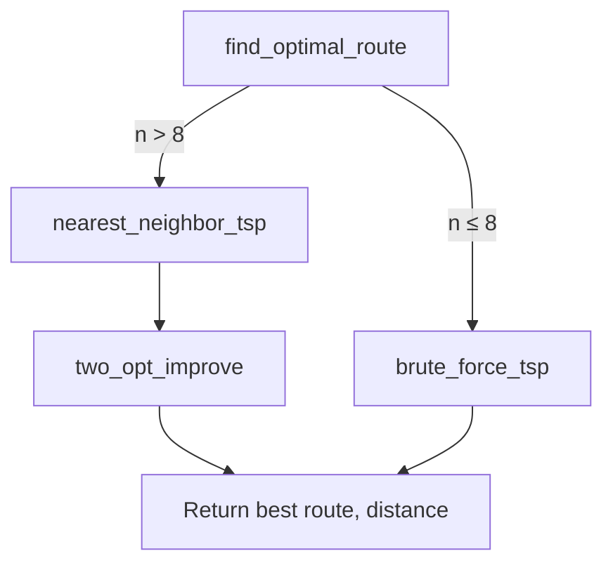

# Design Document: Nearest Neighbor + 2-opt Local Search Routing

## Overview

This feature replaces the current brute-force TSP implementation (`O(n!)`) with a two-phase heuristic approach: a Nearest Neighbor construction heuristic followed by 2-opt local search improvement. The brute-force algorithm becomes computationally infeasible beyond ~10-12 destinations, while the new approach runs in `O(n²)` for construction and `O(n² × k)` for improvement (where k is the number of improvement iterations), enabling routes with 15+ destinations to complete in milliseconds.

The design preserves full backward compatibility. The public API (`find_optimal_route`) retains its signature and return type. A hybrid strategy keeps brute-force for very small inputs (≤8 destinations) where it guarantees optimality, and switches to the heuristic for larger inputs where speed matters more than guaranteed optimality.

The implementation uses only Python standard library constructs, consistent with the project's no-external-dependencies policy.

## Architecture



The routing module exposes a single public function. Internally, it dispatches to either the existing brute-force solver or the new heuristic pipeline based on input size.

## Sequence Diagrams

### Main Routing Flow (Heuristic Path)

```mermaid
sequenceDiagram
    participant Caller as matching.py
    participant Router as find_optimal_route
    participant NN as nearest_neighbor_tsp
    participant Opt as two_opt_improve

    Caller->>Router: find_optimal_route(start, destinations, matrix)
    Router->>Router: len(destinations) > BRUTE_FORCE_THRESHOLD?
    Router->>NN: nearest_neighbor_tsp(start, destinations, matrix)
    NN-->>Router: (initial_route, initial_distance)
    Router->>Opt: two_opt_improve(initial_route, matrix)
    Opt->>Opt: iterate until no improvement
    Opt-->>Router: (improved_route, improved_distance)
    Router-->>Caller: (route_tuple, total_distance)
```

### 2-opt Improvement Iteration

```mermaid
sequenceDiagram
    participant Opt as two_opt_improve
    participant Loop as Edge Swap Loop

    Opt->>Loop: for each pair (i, j) in route
    Loop->>Loop: calculate delta = gain from reversing segment [i..j]
    alt delta < 0 (improvement found)
        Loop->>Loop: reverse segment route[i:j+1]
        Loop->>Opt: restart scan (improved = True)
    else no improvement
        Loop->>Opt: continue to next pair
    end
    Opt-->>Opt: repeat until full pass with no improvement
```

## Components and Interfaces

### Component 1: Route Dispatcher (`find_optimal_route`)

**Purpose**: Public API entry point. Selects the appropriate algorithm based on input size.

**Interface**:
```python
def find_optimal_route(
    start: str,
    destinations: Sequence[str],
    travel_matrix: Dict[str, Dict[str, float]]
) -> Tuple[Tuple[str, ...], float]:
    ...
```

**Responsibilities**:
- Handle edge case of empty destinations
- Dispatch to brute-force for small inputs (≤ BRUTE_FORCE_THRESHOLD)
- Dispatch to nearest-neighbor + 2-opt for larger inputs
- Return consistent format regardless of algorithm used

### Component 2: Nearest Neighbor Construction (`nearest_neighbor_tsp`)

**Purpose**: Build an initial feasible route by greedily selecting the closest unvisited destination at each step.

**Interface**:
```python
def nearest_neighbor_tsp(
    start: str,
    destinations: Sequence[str],
    travel_matrix: Dict[str, Dict[str, float]]
) -> Tuple[Tuple[str, ...], float]:
    ...
```

**Responsibilities**:
- Construct a complete tour visiting all destinations exactly once
- Start and end at the `start` location
- Produce a reasonable initial solution (typically within 20-25% of optimal for random instances)

### Component 3: 2-opt Local Search (`two_opt_improve`)

**Purpose**: Iteratively improve a route by reversing sub-segments that reduce total distance.

**Interface**:
```python
def two_opt_improve(
    route: Tuple[str, ...],
    travel_matrix: Dict[str, Dict[str, float]]
) -> Tuple[Tuple[str, ...], float]:
    ...
```

**Responsibilities**:
- Accept any valid route (start, ..., start) and improve it
- Terminate when no single 2-opt swap yields improvement (local optimum)
- Return the improved route and its total distance

### Component 4: Route Cost Calculator (`_calculate_route_distance`)

**Purpose**: Compute total travel distance for a given route.

**Interface**:
```python
def _calculate_route_distance(
    route: Tuple[str, ...],
    travel_matrix: Dict[str, Dict[str, float]]
) -> float:
    ...
```

**Responsibilities**:
- Sum pairwise distances along the route
- Used by 2-opt for delta evaluation and final distance reporting

## Data Models

### Travel Matrix

```python
# Type alias for the travel matrix
TravelMatrix = Dict[str, Dict[str, float]]
# travel_matrix[from_location][to_location] -> travel_time_hours
```

**Invariants**:
- `travel_matrix[x][x] == 0.0` for all locations x
- `travel_matrix[x][y] >= 0.0` for all x, y
- Matrix may or may not be symmetric (design handles both)

### Route Representation

```python
# A route is a tuple: (start, dest1, dest2, ..., destN, start)
Route = Tuple[str, ...]
```

**Validation Rules**:
- `route[0] == route[-1]` (starts and ends at same location)
- Each destination appears exactly once in `route[1:-1]`
- `len(route) == len(destinations) + 2`

### Algorithm Threshold

```python
BRUTE_FORCE_THRESHOLD: int = 8
```

**Rationale**: 8! = 40,320 permutations completes in <10ms on modern hardware. 9! = 362,880 is still fast but 10! = 3,628,800 starts to become noticeable. Threshold of 8 provides guaranteed optimality for small route groups while the checkpoint test (10 destinations, <0.25s) requires the heuristic path.

## Key Functions with Formal Specifications

### Function 1: nearest_neighbor_tsp()

```python
def nearest_neighbor_tsp(
    start: str,
    destinations: Sequence[str],
    travel_matrix: Dict[str, Dict[str, float]]
) -> Tuple[Tuple[str, ...], float]:
```

**Preconditions:**
- `start` is a valid key in `travel_matrix`
- `destinations` is non-empty
- All destinations are valid keys in `travel_matrix`
- `travel_matrix[x][y]` exists for all x, y in `{start} ∪ destinations`

**Postconditions:**
- Returns `(route, distance)` where `route[0] == route[-1] == start`
- Every element of `destinations` appears exactly once in `route[1:-1]`
- `distance` equals the sum of `travel_matrix[route[i]][route[i+1]]` for all i
- Route length is `len(destinations) + 2`

**Loop Invariants:**
- `visited` grows by exactly one element per iteration
- `len(visited) + len(unvisited) == len(destinations)` at all times
- `current` is always the last destination added to the route

### Function 2: two_opt_improve()

```python
def two_opt_improve(
    route: Tuple[str, ...],
    travel_matrix: Dict[str, Dict[str, float]]
) -> Tuple[Tuple[str, ...], float]:
```

**Preconditions:**
- `route` is a valid tour: `route[0] == route[-1]`, all interior nodes unique
- `len(route) >= 4` (start + at least 2 destinations + return)
- All locations in route exist in `travel_matrix`

**Postconditions:**
- Returns `(improved_route, improved_distance)`
- `improved_distance <= initial_distance` (never makes route worse)
- `improved_route` visits the same set of destinations as input `route`
- `improved_route[0] == improved_route[-1] == route[0]`
- No single 2-opt swap can further reduce `improved_distance` (local optimum)

**Loop Invariants:**
- After each full pass through all (i, j) pairs without improvement, the route is 2-optimal
- The route distance is monotonically non-increasing across iterations
- The set of visited destinations remains unchanged after each swap

### Function 3: _calculate_route_distance()

```python
def _calculate_route_distance(
    route: Tuple[str, ...],
    travel_matrix: Dict[str, Dict[str, float]]
) -> float:
```

**Preconditions:**
- `route` has at least 2 elements
- All consecutive pairs exist in `travel_matrix`

**Postconditions:**
- Returns `sum(travel_matrix[route[i]][route[i+1]] for i in range(len(route)-1))`
- Result is non-negative
- No side effects

## Algorithmic Pseudocode

### Nearest Neighbor Construction

```python
def nearest_neighbor_tsp(start, destinations, travel_matrix):
    """
    ALGORITHM: Greedy nearest-neighbor tour construction
    TIME COMPLEXITY: O(n²) where n = len(destinations)
    SPACE COMPLEXITY: O(n)
    """
    unvisited = set(destinations)
    route = [start]
    current = start
    total_distance = 0.0

    while unvisited:
        # Find closest unvisited destination
        nearest = None
        nearest_dist = float("inf")
        for candidate in unvisited:
            d = travel_matrix[current][candidate]
            if d < nearest_dist:
                nearest_dist = d
                nearest = candidate

        # Move to nearest destination
        route.append(nearest)
        total_distance += nearest_dist
        current = nearest
        unvisited.remove(nearest)

    # Return to start
    total_distance += travel_matrix[current][start]
    route.append(start)

    return tuple(route), total_distance
```

### 2-opt Local Search

```python
def two_opt_improve(route, travel_matrix):
    """
    ALGORITHM: 2-opt local search
    TIME COMPLEXITY: O(n² × k) where k = number of improvement rounds
    SPACE COMPLEXITY: O(n)
    
    The 2-opt swap reverses a segment of the route. For a route
    [... a, b, ..., c, d ...], reversing the segment [b..c] gives
    [... a, c, ..., b, d ...]. This is beneficial when:
        dist(a,c) + dist(b,d) < dist(a,b) + dist(c,d)
    """
    # Work with a mutable list internally
    current_route = list(route)
    n = len(current_route)  # includes start and end (same node)
    improved = True

    while improved:
        improved = False
        for i in range(1, n - 2):
            for j in range(i + 1, n - 1):
                # Calculate improvement delta
                # Current edges: route[i-1]->route[i] and route[j]->route[j+1]
                # New edges: route[i-1]->route[j] and route[i]->route[j+1]
                a, b = current_route[i - 1], current_route[i]
                c, d = current_route[j], current_route[j + 1]

                old_dist = travel_matrix[a][b] + travel_matrix[c][d]
                new_dist = travel_matrix[a][c] + travel_matrix[b][d]

                if new_dist < old_dist:
                    # Reverse the segment between i and j (inclusive)
                    current_route[i:j + 1] = current_route[i:j + 1][::-1]
                    improved = True
                    break  # restart scan after improvement
            if improved:
                break

    improved_route = tuple(current_route)
    distance = _calculate_route_distance(improved_route, travel_matrix)
    return improved_route, distance
```

### Hybrid Dispatcher

```python
BRUTE_FORCE_THRESHOLD = 8

def find_optimal_route(start, destinations, travel_matrix):
    """
    Hybrid dispatcher: exact for small inputs, heuristic for large.
    """
    if not destinations:
        return (start, start), 0.0

    if len(destinations) <= BRUTE_FORCE_THRESHOLD:
        return brute_force_tsp(start, destinations, travel_matrix)

    # Heuristic path: construct + improve
    route, distance = nearest_neighbor_tsp(start, destinations, travel_matrix)
    route, distance = two_opt_improve(route, travel_matrix)
    return route, distance
```

## Example Usage

```python
from src.optimization.routing import find_optimal_route

# Small input (uses brute-force, guarantees optimality)
route, dist = find_optimal_route("A", ["B", "C"], travel_matrix)
# route = ("A", "B", "C", "A"), dist = 12.0

# Large input (uses nearest-neighbor + 2-opt)
destinations = [f"LOC{i:03d}" for i in range(1, 16)]
route, dist = find_optimal_route("LOC000", destinations, travel_matrix)
# route = ("LOC000", ..., "LOC000"), all 15 destinations visited
# Completes in milliseconds instead of hours
```

## Correctness Properties

*A property is a characteristic or behavior that should hold true across all valid executions of a system — essentially, a formal statement about what the system should do. Properties serve as the bridge between human-readable specifications and machine-verifiable correctness guarantees.*

### Property 1: Route Completeness

*For any* valid start location, non-empty set of destinations, and complete travel matrix, the route returned by the Router SHALL contain every destination exactly once in positions between the first and last elements.

**Validates: Requirements 2.1, 3.3, 4.3**

### Property 2: Route Circularity

*For any* valid start location and set of destinations, the route returned by the Router (and by each internal solver) SHALL have its first and last elements equal to the start location.

**Validates: Requirements 2.3, 3.4, 4.1, 4.2**

### Property 3: Distance Accuracy

*For any* valid input, the distance value returned alongside the route SHALL equal the sum of `travel_matrix[route[i]][route[i+1]]` for all consecutive index pairs in the route.

**Validates: Requirements 2.4, 4.5, 5.1**

### Property 4: 2-opt Non-degradation

*For any* valid route provided as input to the Two_Opt_Optimizer, the returned route distance SHALL be less than or equal to the input route distance.

**Validates: Requirement 3.1**

### Property 5: 2-opt Local Optimality

*For any* route returned by the Two_Opt_Optimizer, no single 2-opt swap (reversing any interior segment) SHALL produce a shorter route.

**Validates: Requirement 3.2**

### Property 6: Optimality for Small Inputs

*For any* set of destinations with size less than or equal to BRUTE_FORCE_THRESHOLD, the route returned by the Router SHALL have a distance equal to the optimal (minimum) distance computed by exhaustive search.

**Validates: Requirements 1.2, 6.3**

### Property 7: Nearest Neighbor Greedy Selection

*For any* start location and set of destinations, each successive destination in the route produced by the Nearest_Neighbor_Solver SHALL be the closest unvisited destination from the previous position at the time of selection.

**Validates: Requirement 2.2**

## Error Handling

### Error Scenario 1: Empty Destinations

**Condition**: `destinations` is an empty list/sequence
**Response**: Return trivial route `(start, start)` with distance `0.0`
**Recovery**: No error raised; handled as a valid edge case

### Error Scenario 2: Missing Matrix Entries

**Condition**: `travel_matrix[x][y]` raises KeyError for some pair
**Response**: Let the KeyError propagate naturally (same behavior as current brute-force)
**Recovery**: Caller is responsible for providing complete matrix data

### Error Scenario 3: Single Destination

**Condition**: `len(destinations) == 1`
**Response**: Both algorithms handle correctly; brute-force path taken (1 ≤ 8)
**Recovery**: Returns `(start, dest, start)` with round-trip distance

## Testing Strategy

### Unit Testing Approach

All existing tests in `test_routing.py` continue to pass unchanged. They are algorithm-agnostic and test:
- Route completeness (all destinations visited)
- Route circularity (starts/ends at start)
- Correct distance calculation
- Edge cases (empty destinations, single destination)

### Property-Based Testing Approach

**Property Test Library**: Python `unittest` with randomized inputs (no external PBT library due to dependency constraints)

Key properties to test:
- Route always contains exactly `len(destinations) + 2` elements
- Distance is always non-negative
- 2-opt result is never worse than nearest-neighbor result
- Result is deterministic for same input

### Performance Testing

The `test_routing_checkpoint_a.py` validates that 10 destinations complete in <0.25s (brute-force fails this). The scalability tests in `tests/performance/test_scalability.py` exercise the scheduler with up to 4000 jobs and 350 engineers.

### Integration Testing

`test_matching.py` and `test_scheduler_integration.py` verify that the matching module correctly uses `find_optimal_route` for travel time estimation during job assignment.

## Performance Considerations

| Input Size (n) | Brute Force | Nearest Neighbor | NN + 2-opt |
|---|---|---|---|
| 5 | 120 perms, <1ms | <1ms | <1ms |
| 8 | 40,320 perms, ~10ms | <1ms | <1ms |
| 10 | 3.6M perms, ~2s | <1ms | <1ms |
| 15 | 1.3T perms, infeasible | <1ms | ~1ms |
| 20 | infeasible | <1ms | ~2ms |

The hybrid threshold of 8 ensures:
- Guaranteed optimal results for the common case (engineers with ≤8 jobs)
- Sub-second response for the checkpoint test (10 destinations)
- Millisecond-scale response for scalability tests (15-20 jobs/engineer)

## Security Considerations

No security implications. The routing module performs pure computation on in-memory data structures with no I/O, network access, or user-facing input parsing.

## Dependencies

None. The implementation uses only Python standard library:
- `itertools.permutations` (existing, for brute-force)
- `typing` (existing, for type annotations)

No new dependencies are introduced, consistent with the project's pure-Python policy.
