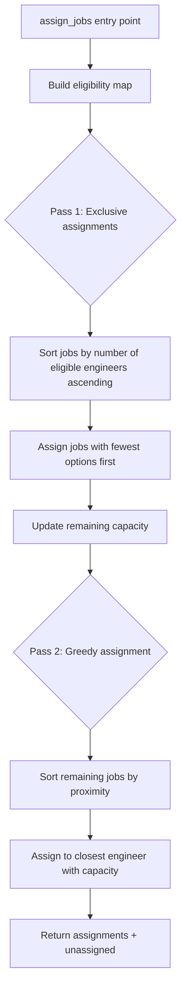
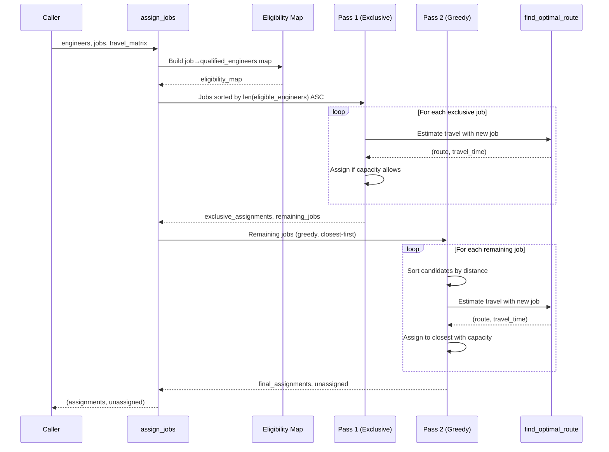

# Design Document: Two-Pass Matching

## Overview

The current `assign_jobs` function uses a single-pass greedy strategy that processes jobs sequentially, assigning each to the closest engineer with capacity and the required skills. This fails in scenarios where a multi-skilled engineer gets consumed by shared-skill jobs, leaving exclusive-skill jobs unassignable (benchmarks 4 and 5).

The two-pass matching strategy solves this by prioritizing jobs that have limited engineer options. In **Pass 1**, jobs where only one (or very few) engineers qualify are locked in first — these are "exclusive" assignments that cannot be deferred. In **Pass 2**, the remaining jobs are assigned using the existing greedy closest-engineer logic against the reduced available capacity. This ensures rare-skill engineers are reserved for jobs only they can handle.

The implementation maintains the same function signature and is backwards-compatible with all existing tests.

## Architecture



## Sequence Diagram



## Components and Interfaces

### Component 1: Eligibility Map Builder

**Purpose**: For each job, compute which engineers have the required skills. This is the foundation for determining exclusivity.

**Interface**:
```python
def _build_eligibility_map(
    engineers: List[Engineer],
    jobs: List[Job],
) -> Dict[int, List[Engineer]]:
    """Map each job ID to the list of engineers qualified to perform it."""
    ...
```

**Responsibilities**:
- Filter engineers by skill match for each job
- Return empty list for jobs no engineer can handle (these are immediately unassignable)

### Component 2: Capacity Tracker

**Purpose**: Track remaining capacity for each engineer as jobs are assigned across both passes.

**Interface**:
```python
def _has_capacity(
    engineer: Engineer,
    current_jobs: List[Job],
    new_job: Job,
    travel_matrix: Dict[str, Dict[str, float]],
) -> bool:
    """Check if adding new_job to engineer's current jobs fits within working hours."""
    ...
```

**Responsibilities**:
- Sum current job durations
- Estimate total travel time using `find_optimal_route` for the full job set including the new job
- Compare total (job_time + travel_time) against `engineer.working_hours`

### Component 3: Pass 1 — Exclusive Assignment

**Purpose**: Identify and assign jobs with limited engineer options first, ensuring rare skills are not wasted.

**Interface**:
```python
def _assign_exclusive_jobs(
    jobs_by_exclusivity: List[Job],
    eligibility_map: Dict[int, List[Engineer]],
    assignments: Dict[int, List[Job]],
    travel_matrix: Dict[str, Dict[str, float]],
    engineers: List[Engineer],
) -> List[Job]:
    """Assign exclusive jobs and return remaining unprocessed jobs."""
    ...
```

**Responsibilities**:
- Sort jobs by number of eligible engineers (ascending — most constrained first)
- Define exclusivity threshold (jobs with ≤ N eligible engineers, where N is a tunable parameter, default 1)
- Assign each exclusive job to the best qualified engineer with capacity
- Track capacity consumed so far

### Component 4: Pass 2 — Greedy Assignment

**Purpose**: Assign remaining jobs using the existing closest-engineer-with-capacity logic.

**Interface**:
```python
def _assign_remaining_jobs(
    remaining_jobs: List[Job],
    eligibility_map: Dict[int, List[Engineer]],
    assignments: Dict[int, List[Job]],
    travel_matrix: Dict[str, Dict[str, float]],
    engineers: List[Engineer],
) -> List[Job]:
    """Assign remaining jobs greedily by proximity. Return unassigned jobs."""
    ...
```

**Responsibilities**:
- For each remaining job, sort eligible engineers by travel distance
- Try closest engineer first, fall back to next closest if capacity exceeded
- Return any jobs that cannot be assigned

## Data Models

### Eligibility Map

```python
# Maps job ID -> list of engineers qualified to perform the job
EligibilityMap = Dict[int, List[Engineer]]
```

### Exclusivity Score

```python
# The number of engineers that can perform a given job
# Lower score = more exclusive = higher priority in Pass 1
exclusivity_score: int = len(eligibility_map[job.id])
```

### Capacity State (implicit)

```python
# Tracked via assignments dict — capacity is computed dynamically
# by summing job lengths + estimated travel for current assignment set
assignments: Dict[int, List[Job]]  # engineer_id -> assigned jobs
```

## Key Functions with Formal Specifications

### Function: assign_jobs (updated)

```python
def assign_jobs(
    engineers: List[Engineer],
    jobs: List[Job],
    travel_matrix: Dict[str, Dict[str, float]],
) -> tuple[Dict[int, List[Job]], List[Job]]:
    ...
```

**Preconditions:**
- `engineers` is a list of valid Engineer objects (may be empty)
- `jobs` is a list of valid Job objects (may be empty)
- `travel_matrix` contains entries for all locations referenced by engineers and jobs
- All engineer working_hours are positive
- All job lengths are positive

**Postconditions:**
- Every job appears in exactly one of: an engineer's assignment list OR the unassigned list
- No job is assigned to an engineer who lacks the required skills
- For each engineer, `sum(job.length for job in assigned) + travel_time <= engineer.working_hours`
- The return type matches the existing signature exactly
- Engineers with no assigned jobs have an empty list in the assignments dict

**Loop Invariants:**
- At any point during assignment, the union of all assigned jobs and remaining/unassigned jobs equals the full input job set
- No engineer's total load (jobs + travel) exceeds their working_hours

### Function: _build_eligibility_map

```python
def _build_eligibility_map(
    engineers: List[Engineer],
    jobs: List[Job],
) -> Dict[int, List[Engineer]]:
    ...
```

**Preconditions:**
- `engineers` and `jobs` are valid lists (may be empty)
- Skills are normalized to lowercase (guaranteed by model __post_init__)

**Postconditions:**
- Returns a dict with one entry per job (keyed by job.id)
- Each value is a list of engineers who possess ALL required skills for that job
- If a job requires no skills, all engineers are eligible
- Order of engineers in each list is undefined

### Function: _has_capacity

```python
def _has_capacity(
    engineer: Engineer,
    current_jobs: List[Job],
    new_job: Job,
    travel_matrix: Dict[str, Dict[str, float]],
) -> bool:
    ...
```

**Preconditions:**
- `engineer` is a valid Engineer with positive working_hours
- `current_jobs` are already assigned to this engineer (capacity was valid before)
- `new_job` is the candidate job to add
- `travel_matrix` contains all relevant locations

**Postconditions:**
- Returns `True` if and only if adding `new_job` to `current_jobs` keeps total load ≤ working_hours
- Total load = sum of all job lengths + estimated travel time for complete route
- Does not mutate any input

## Algorithmic Pseudocode

### Main Algorithm: Two-Pass Assignment

```python
def assign_jobs(engineers, jobs, travel_matrix):
    # Initialize
    assignments = {e.id: [] for e in engineers}
    
    # Step 1: Build eligibility map
    eligibility_map = _build_eligibility_map(engineers, jobs)
    
    # Immediately mark impossible jobs (no qualified engineer)
    unassigned = []
    assignable_jobs = []
    for job in jobs:
        if not eligibility_map[job.id]:
            unassigned.append(job)
        else:
            assignable_jobs.append(job)
    
    # Step 2: Pass 1 — Exclusive assignments
    # Sort by exclusivity (fewest eligible engineers first)
    exclusive_jobs = [j for j in assignable_jobs if len(eligibility_map[j.id]) <= exclusivity_threshold]
    exclusive_jobs.sort(key=lambda j: len(eligibility_map[j.id]))
    
    remaining_after_pass1 = []
    for job in exclusive_jobs:
        assigned = False
        # Try each eligible engineer, prefer closest with capacity
        candidates = sorted(
            eligibility_map[job.id],
            key=lambda e: travel_matrix[e.location][job.location]
        )
        for engineer in candidates:
            if _has_capacity(engineer, assignments[engineer.id], job, travel_matrix):
                assignments[engineer.id].append(job)
                assigned = True
                break
        if not assigned:
            remaining_after_pass1.append(job)
    
    # Non-exclusive jobs also go to pass 2
    non_exclusive_jobs = [j for j in assignable_jobs if len(eligibility_map[j.id]) > exclusivity_threshold]
    pass2_jobs = remaining_after_pass1 + non_exclusive_jobs
    
    # Step 3: Pass 2 — Greedy closest-first assignment
    for job in pass2_jobs:
        candidates = sorted(
            eligibility_map[job.id],
            key=lambda e: travel_matrix[e.location][job.location]
        )
        assigned = False
        for engineer in candidates:
            if _has_capacity(engineer, assignments[engineer.id], job, travel_matrix):
                assignments[engineer.id].append(job)
                assigned = True
                break
        if not assigned:
            unassigned.append(job)
    
    return assignments, unassigned
```

### Capacity Check Algorithm

```python
def _has_capacity(engineer, current_jobs, new_job, travel_matrix):
    test_jobs = current_jobs + [new_job]
    total_job_time = sum(j.length for j in test_jobs)
    
    # Estimate travel for the full route
    job_locations = [j.location for j in test_jobs]
    _, estimated_travel = find_optimal_route(engineer.location, job_locations, travel_matrix)
    
    return total_job_time + estimated_travel <= engineer.working_hours
```

## Example Usage

```python
from src.models.engineer import Engineer
from src.models.job import Job
from src.optimization.matching import assign_jobs

# Benchmark 4 scenario: capacity-skill trade-off
engineers = [
    Engineer(id=1, name="Alice", location="A", skills=["repair", "install"], working_hours=3.0),
    Engineer(id=2, name="Bob", location="B", skills=["repair"], working_hours=8.0),
]
jobs = [
    Job(id=1, location="A", time="09:00", required_skills=["repair"], length=2.0),
    Job(id=2, location="A", time="10:00", required_skills=["install"], length=2.0),
    Job(id=3, location="B", time="11:00", required_skills=["repair"], length=2.0),
]
travel_matrix = {"A": {"A": 0.0, "B": 1.0}, "B": {"A": 1.0, "B": 0.0}}

assignments, unassigned = assign_jobs(engineers, jobs, travel_matrix)

# Pass 1 identifies job 2 (install) as exclusive — only Alice can do it
# Alice gets job 2 (2.0h job + 0h travel = 2.0h, fits in 3.0h capacity)
# Pass 2 assigns job 1 and job 3 to Bob (greedy closest)
# Result: all jobs assigned, no unassigned
assert len(unassigned) == 0
assert 2 in [j.id for j in assignments[1]]  # Alice has the install job
assert len(assignments[2]) == 2              # Bob has both repair jobs
```

## Correctness Properties

*A property is a characteristic or behavior that should hold true across all valid executions of a system — essentially, a formal statement about what the system should do. Properties serve as the bridge between human-readable specifications and machine-verifiable correctness guarantees.*

### Property 1: Assignment Completeness

*For any* list of engineers, jobs, and travel matrix, every input job must appear exactly once in either an engineer's assignment list or the unassigned list, and the assignments dictionary must contain an entry for every input engineer (including those with empty lists).

**Validates: Requirements 5.1, 5.4, 1.4**

### Property 2: No Duplicate Assignments

*For any* list of engineers, jobs, and travel matrix, no job ID shall appear in more than one engineer's assignment list.

**Validates: Requirement 5.2**

### Property 3: Skill Validity

*For any* assignment produced by the Matching_Engine, every assigned job's required skills must be a subset of the assigned engineer's skills.

**Validates: Requirements 5.3, 1.1**

### Property 4: Capacity Validity

*For any* assignment produced by the Matching_Engine, each engineer's total load (sum of assigned job durations plus optimal route travel time) must not exceed that engineer's working hours.

**Validates: Requirements 4.1, 4.2, 4.3**

### Property 5: Exclusive Job Assignment

*For any* job where exactly one engineer possesses the required skills and that engineer has sufficient capacity to perform the job alone (job duration + travel time ≤ working hours), that job must not appear in the unassigned list.

**Validates: Requirements 2.1, 2.2, 2.3**

## Error Handling

### Scenario 1: No Qualified Engineers for a Job

**Condition**: A job requires skills that no engineer possesses
**Response**: Job is immediately added to `unassigned` list (during eligibility map construction)
**Recovery**: No recovery needed — this is expected behavior

### Scenario 2: Exclusive Job Cannot Fit (Capacity Exceeded)

**Condition**: An exclusive job's only qualified engineer lacks capacity even without other jobs
**Response**: Job falls through to Pass 2 for a second attempt, then to `unassigned` if still not assignable
**Recovery**: The job is reported in the unassigned list for manual handling

### Scenario 3: Empty Inputs

**Condition**: Empty engineers list or empty jobs list
**Response**: Return empty assignments dict and all jobs as unassigned (empty engineers) or empty unassigned (empty jobs)
**Recovery**: N/A — graceful handling

### Scenario 4: Travel Matrix Missing Location

**Condition**: A location referenced by a job or engineer is not in the travel matrix
**Response**: `travel_matrix.get()` returns `float("inf")` for unknown locations, making assignment to that engineer impossible
**Recovery**: Job may become unassigned if no reachable engineer exists

## Testing Strategy

### Unit Testing Approach

- All existing tests in `test_matching.py` must continue to pass without modification
- New tests for exclusive-job scenarios (mirroring benchmarks 4 and 5 patterns)
- Tests for the helper functions (`_build_eligibility_map`, `_has_capacity`)
- Edge cases: all jobs exclusive, no jobs exclusive, ties in exclusivity score

### Property-Based Testing Approach

**Property Test Library**: hypothesis (Python)

Key properties to test with random inputs:
- Completeness: assigned + unassigned = input jobs
- No duplicates in assignments
- Skill constraints always respected
- Capacity never exceeded
- Deterministic: same input always produces same output

### Integration Testing Approach

- Benchmarks 4 and 5 must pass (all jobs assigned, matching optimal solution)
- Benchmarks 1, 2, 3 must continue to pass (no regression)
- Scheduler integration: `Scheduler.create_schedule()` returns correct results with new matching

## Performance Considerations

- The eligibility map is computed once upfront (O(jobs × engineers)) — no repeated skill checks
- Pass 1 only processes exclusive jobs (typically a small subset), so overhead is minimal
- Pass 2 uses identical logic to the current implementation — no performance regression for non-exclusive jobs
- `find_optimal_route` is called for capacity checks as before — this is the dominant cost and is unchanged
- The exclusivity threshold (default: 1) keeps Pass 1 focused on truly constrained jobs

## Security Considerations

No security implications. This is a pure algorithmic change with no I/O, network access, or external dependencies.

## Dependencies

- `src.optimization.routing.find_optimal_route` — used for travel time estimation in capacity checks
- `src.models.engineer.Engineer` — engineer data model
- `src.models.job.Job` — job data model
- No external dependencies (pure Python standard library)
